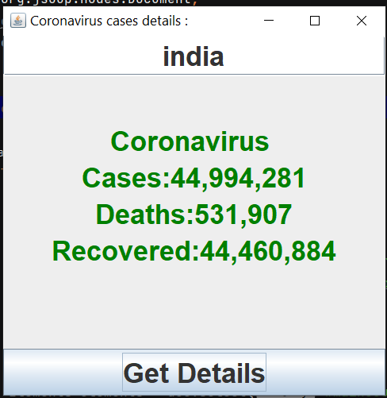

# Web Scraping COVID-19 Cases Details Project
This is a web scraping project that retrieves COVID-19 cases details country-wise from a website using Java, Maven, the Jsoup library, and Java Swing for the graphical user interface (GUI).

# Features
1. Website Scraping: The application retrieves COVID-19 cases details from a specific website.
2. Country-wise Data: The project provides COVID-19 cases details for each country individually.
3. Graphical User Interface: The application utilizes Java Swing to display the scraped data in a user-friendly GUI.

# Technologies Used
Java

Maven

Jsoup Library

Java Swing

# Getting Started
To run this project locally, follow these steps:

Clone the repository: git clone https://github.com/samridhi-sahu/Covid-19-cases-web-scrapping-using-java.git

Open the project directory: cd Covid-19-cases-web-scrapping-using-java

Build the project using Maven: mvn clean install

Run the application:

java -jar target/Covid-19-cases-web-scrapping-using-java.jar

The GUI application will launch, displaying the COVID-19 cases details country-wise.

Click on a specific country to view its COVID-19 cases information.

# Configuration

The application is configured to scrape data from a specific website. If you want to scrape data from a different website, you can modify the URL in the Scraper.java file:

String url = "https://www.example.com/covid-19";

Replace "https://www.example.com/covid-19" with the URL of the website you want to scrape.

# Dependencies

This project uses the Jsoup library for web scraping. Maven will automatically download the required dependencies specified in the pom.xml file.

<dependencies>
  <dependency>
    <groupId>org.jsoup</groupId>
    <artifactId>jsoup</artifactId>
    <version>1.14.3</version>
  </dependency>
</dependencies>

